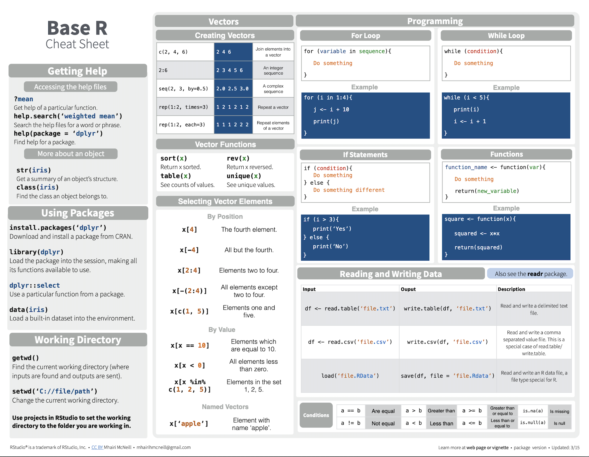

```{r setup, include=FALSE}
knitr::opts_chunk$set(echo = TRUE)
```

Fecha de la ultima revisión
```{r echo=FALSE}

Sys.Date()
```

```{r, eval=TRUE, echo=FALSE}
colorize <- function(x, color) {
  if (knitr::is_latex_output()) {
    sprintf("\\textcolor{%s}{%s}", color, x)
  } else if (knitr::is_html_output()) {
    sprintf("<span style='color: %s;'>%s</span>", color, 
      x)
  } else x
}

#`r colorize("some words in red", "red")`
```

# Códigos básicos en R

***

# Responsabilidad del estudiante

`r colorize("EL ESTUDIANTE es COMPLETAMENTE RESPONSABLE","red")` de ver estos vídeos y entender como usar la plataforma.

***

# Base R

Cuando uno se refiere a Base R se refiere a las funciones básicas del programa. Muchas de estas funciones son las primeras que fueron desarrolladas.  Es importante entender la sintaxis del programa p[ara poder hacer los análisis con facilidades. Para ayudar con estos pasos hay mucha información en *YouTube* disponible sugiero que vean lo siguiente. En el enlace hay 47 vídeos de como utilizar las funciones de R.  Mi sugerencia es vean los siguientes vídeos primero 1,2,3,4,25,26.  No es necesario ver todos al menos que ya encontró su futura dirección de estudios.  


EL enlace es: [Aprender Base R](https://www.youtube.com/playlist?list=PL0iUxoCEznfixaKofFkoOho26swycdAmy)


La sugerencias es que deberían ver los vídeos abajo múltiples veces y después compartir con un otro estudiante y hablar de los que entendió.  


***
# Enlace para todos los Cheetsheets

Los *cheatsheets* son hojas donde se encuentra las funciones principales de algunos paquetes.  Son guías para conocer y aplicar las funciones.  Abrir el siguiente enlace donde encontrarán muchos "Cheatsheets", buscan abajo el que se llama "Base R". Este es la hoja de información básica de como utilizar R.   

En el primer enlace pueden bajar un pdf del **Base R cheatsheet**
[Página de Cheatsheets](https://rstudio.com/resources/cheatsheets/)


***

También lo pueden encontrar aquí como imagen. 

```{r echo=FALSE, out.width = '100%'}

```
La segunda pagina


```{r echo=FALSE, out.width = '100%'}
knitr::include_graphics("Graficos/rbase2.png")
```


***
# Los cheatsheets en Español

En el siguiente enlace vaya muy abajo y encontrarán los *cheatsheets* en otros idiomas incluyendo en español. 

En el primer enlace pueden pajar un pdf del cheatsheet
[Página de Cheatsheets](https://rstudio.com/resources/cheatsheets/)

