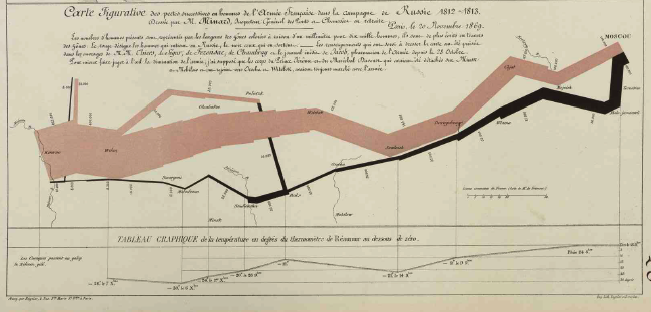
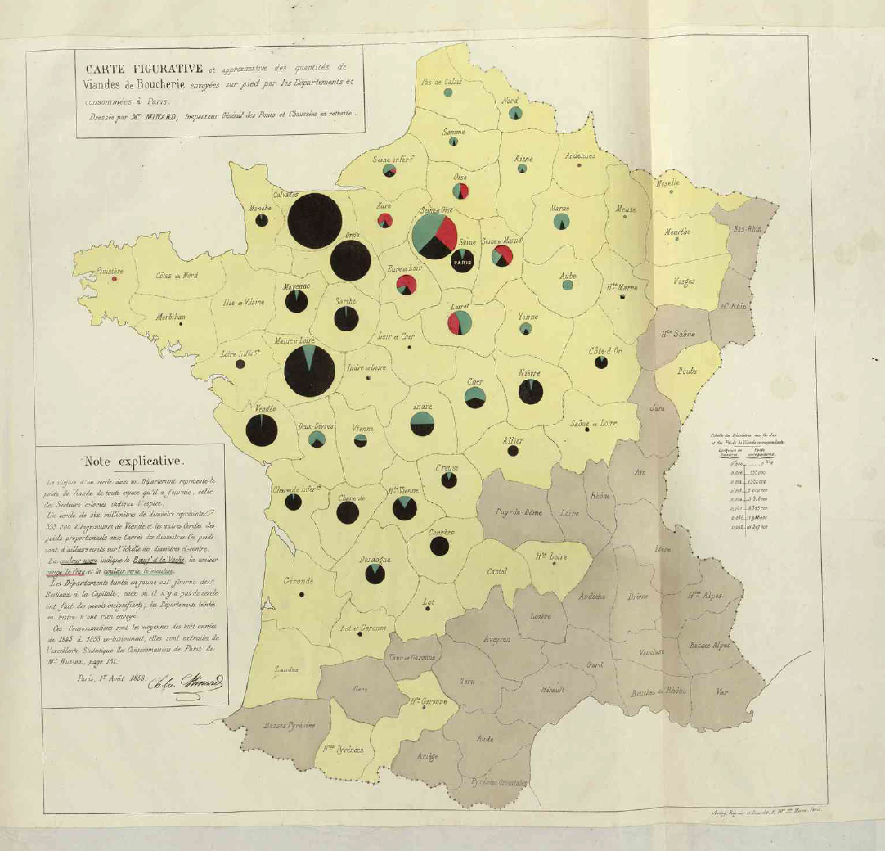
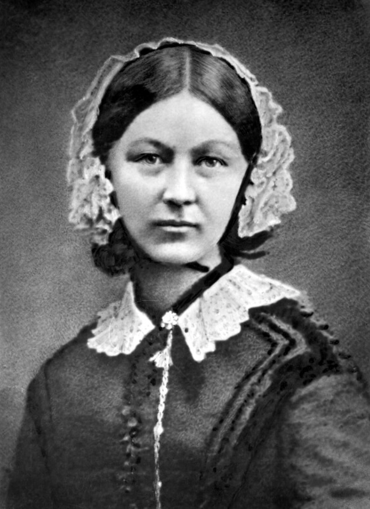
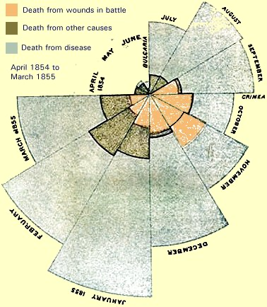

```{r setup, include=FALSE}
knitr::opts_chunk$set(echo = TRUE, fig.align='center')
```


```{r, eval=TRUE, echo=FALSE}
colorize <- function(x, color) {
  if (knitr::is_latex_output()) {
    sprintf("\\textcolor{%s}{%s}", color, x)
  } else if (knitr::is_html_output()) {
    sprintf("<span style='color: %s;'>%s</span>", color, 
      x)
  } else x
}

#`r colorize("some words in red", "red")`
```

<br>

<br>

<br>

<br>

<br>

<br>

<br>

Fecha de la ultima revisión
```{r echo=FALSE}

Sys.Date()
```


```{r, echo=FALSE, fig.show = "hold", out.width = "20%", fig.align = "default"}
knitr::include_graphics(c("Graficos/hex_ggversa.png", "Graficos/hex_Visualizacion_Datos.png"))
```

```{r include=FALSE, message=FALSE}
library(tidyverse)
library(gridExtra)
library(gt)
library(random)
library(ggplot2)
```


# ¿Qué es la visualización de datos?

La visualización de datos tiene como objetivo facilitar la apreciación de datos y determinar si existen patrones. Naturalmente, no se necesitan gráficos para entender ciertas ideas.  Por ejemplo, si un estudiante tiene 25 años y otra estudiante tiene 20 años, no hay que crear un gráfico para entender que hay 5 años de diferencia entre una y el otro. Así que producimos gráficos típicamente cuando hay muchos datos y hay posible solapamiento entre los valores.  Si, por ejemplo, nos informan que la edad de los estudiantes en un salón de preescolares es de cerca de 5 años y los de primer año universitario es de 19 años, es fácil percibir la diferencia entre esos grupos aunque allá estudiantes de diferentes edades en cada grupo.  Pero, por otro lado, si se describen las edades de los estudiantes de dos salones en la misma universidad, pudiese haber solapamiento entre las edades.  Entonces, determinar si la edad de esos dos grupos de estudiantes es igual o es diferente ya no es tan evidente. 

Veamos un ejemplo.  Si uno lista las edades de estudiantes universitarios de dos salones, tendremos el reto de intentar discernir si sus edades son aproximadamente iguales o diferentes solo al mirar la lista.  ¿Será posible?  A ver, intenta explicar cuál es la diferencia (si existe alguna) en las edades de las dos listas siguientes.

Edades del salón 1:

```{r echo=FALSE, warning=FALSE}
set.seed(654875)

Edad_Salón_1=randomNumbers(100, min=20, max=27, col=1) # la función proviene del paquete "random" 

Edad_Salón_1=as.data.frame(Edad_Salón_1)

Edad_Salón_1=as.list(Edad_Salón_1)
Edad_Salón_1
```

****
Edades del salón 2:

```{r echo=FALSE}

set.seed(654875)
Edad_Salón_2=randomNumbers(100, min=20, max=26, col=1)

Edad_Salón_2=as.data.frame(Edad_Salón_2)

Edad_Salón_2=as.list(Edad_Salón_2)
Edad_Salón_2
```

Probablemente notes que no es evidente a primera vista cuál es la diferencia entre las dos listas de datos.  Necesitamos ayuda para visualizar la diferencia.  A continuación se explican un par de maneras de ver esa misma información.


***
## Resumir la información en tablas

Una alternativa razonable para discernir la diferencia entre las edades de los dos grupos de estudiantes listadas arriba es resumir los datos en una tabla; o sea, por grupos, Salón 1 y Salón 2. Al mirar la **Tabla: Edad de los Estudiantes** podemos apreciar que hay muy poca diferencia entre los promedios de las edades, pero también podemos ver que la edad máxima de los estudiantes es diferente.

En conclusión, con este simple ejercicio podemos afirmar que las dos listas de edades tienen valores muy similares, pero que hay otras características (por ejemplo, el valor máximo) que los hace diferentes. También podemos reconocer que si hay muchos valores en una lista, típicamente los humanos no podemos entender esos patrones a simple vista. Por lo tanto, es importante recurrir a diversos métodos para resumir los datos de forma más concisa, efectiva y eficiente, tal como lo demostraremos próximamente.

```{r include=FALSE}
Edad_Salón_1$Seq=seq(1:100)
Edad_Salón_2$Seq=seq(1:100)

df=bind_rows(Edad_Salón_1, Edad_Salón_2)
df$Salón=rep(c("Salón_1","Salón_2"), each=100)
df

```


```{r include=FALSE, warning=FALSE}
as_tibble(df)
```


```{r , warning=FALSE, message=FALSE}
# para disparar tabla:
df%>%
  select(V1, Salón)%>%
  group_by(Salón)%>%
  summarize(promedio=mean(V1), 
             mínima=min(V1),
             máxima=max(V1))%>%
  gt()%>%
  tab_header(
    title = "Tabla: Edad de los Estudiantes")
  
```

***

## Cómo visualizar muchos datos

Llegar a conclusiones prematuras sobre las edades de los estudiantes simplemente con echarle un vistazo rápido nos podría conducir a un error. Una mejor alternativa es visualizar las listas de datos con un gráfico.   En ese caso, podemos visualizar esos datos con un gráfico llamado **Diagrama de caja** o *Boxplot*, tal como se muestra en **Figura: Diagrama de Caja**. Se observa que el promedio es aproximadamente igual, que ambos muestran valores mínimos idénticos, y que entonces la única diferencia es el valor máximo en los datos.  Esa conclusión se pudo alcanzar simplemente produciendo un gráfico. Esa es la importancia de visualizar los datos antes de llegar a conclusiones.

```{r, fig.cap='Figura: Diagrama de Caja'}
# para producir un diagrama de caja:
ggplot(df, aes(y=V1, x=Salón))+
  geom_boxplot() +
  ylab("Edad de los estudiantes")
```


***

# La representación gráfica en la historia

En esta sección se presentan unos ejemplos históricos de visualización gráfica. Esta sección no es exhaustiva y su presentación tiene como objetivo mostrar la evolución y desarrollo de la representación gráfica.

## 1. Campaña de Napoleón

Charles Joseph Minard (1781-1870; Francia) es una de las personas que contribuyó al desarrollo del tema que hoy día se conoce como **gráficas informativas** (o _Information Graphics_ en inglés).  Él se reconoce por sus innovaciones al utilizar gráficos para demostrar patrones.  El gráfico más famoso creado por este señor fue sobre la campaña de guerra de Napoleón para invadir a Rusia (1812-1813), explicado a continuación. 

En la ilustración **Mapa: Campaña de Napoleón** podemos apreciar el movimiento de la campaña de Napoleón para invadir a Rusia. El movimiento de ida está representado con la cantidad de hombres que comenzaron el camino hacia Rusia hasta Moscú desde Paris representado por la barra de color `r colorize("**marrón**", "brown")`, y el viaje de regreso representado con la barra de color **negro**. El ancho de cada barra representa la cantidad de hombres presentes en el ejercicio militar. Los datos históricos comprueban que cuando comenzaron la campaña militar (saliendo de París) eran más de 422 mil soldados, al llegar a Moscú ya eran solamente 100 mil soldados, y cuando finalmente regresaron a París, luego de haber intentado infructuosamente de conquistar a Rusia, Napoleón tenía solamente 10 mil soldados con él.   

Observemos el gráfico debajo de las barras.  Este representa la temperatura al regresar de Moscú.  Se puede observar que a la vez que bajaba la temperatura, más y más de los soldados fallecían.  Podemos concluir, entonces, que la mortandad en gran parte se debió a no estar preparados para el frío. Vale hacer notar que la escala de temperatura en aquel entonces no era de Celcio ni de Farenheit.  La escala ilustrada se llama **Réaumus**, que presentaba un punto de congelación y de ebullición de 0° y 80° respectivamente. Esa escala se usó en múltiples países de Europa hasta mediados del Siglo XIX.

```{r echo=FALSE, out.width = '80%', fig.align='center', fig.cap='Mapa: Campaña de Napoleón'}

```


***

## 2. Origen de la carne de París

Otro ejemplo gráfico de Minard es la **Figura: Origen de la carne de París**.  Este representa la procedencia de la carne que la gente en París consumían en el S XIX. El color **negro** representa carne de res, el color `r colorize("**verde**", "green")` era de la ternera y el color `r colorize("**rojo**", "red")` era de la de cordero.  Vemos que ya Minard hacía uso de gráficos de pastel o torta (o _pie chart_ en inglés) para identificar la proporción de cada grupo y el tamaño del pastel para identificar la cantidad relativa en comparación con los otros departamentos o dependencias políticas locales.

```{r echo=FALSE, out.width = '70%', fig.align='center', fig.cap='Figura: Origen de la carne de París'}

```

***

## 3. Gráfico de Coxcomb

El conflicto de Crimea del 1853 al 1856 fue una de las primeras guerras donde se comenzó a contabilizar la causa de muerte de los soldados. Esta guerra se debió al conflicto entre Rusia y sus aliados por un lado y por otro lado al Imperio Otomano, Francia, Reino Unido y Sardeñia (este último hoy día es parte de Italia). Al comienzo, la causa de la guerra fue por asegurar el acceso de los cristianos a la Tierra Santa en Palestina.  Lo que es interesante de esta guerra con relación a la evolución de la representación gráfica de la información es el impacto que tuvo una enfermera de nombre Florence Nightingale (1820-1910) del Reino Unido. No solo esta señora tuvo una influencia muy importante sobre el desarrollo de las buenas prácticas de la ciencia de la Enfermería, también tuvo un impacto en la forma como se visualizan las causas principales de la mortandad durante una guerra. A continuación una ilustración de Nightingale.

```{r echo=FALSE, fig.cap='Florence Nightingale, pionera de la Ciencia de la Enfermería', out.width = '40%', fig.align='center'}

```

Como enfermera en las campos militares, Nightingale se percató que la gran mayoría de los soldados morían no por la guerra en sí, pero por la pobre calidad de sanidad en los campos de guerra.  Para tratar de convencer a los políticos para que aportaran más recursos para mejorar las condiciones de salud de sus soldados, ella recolectó datos y produjo unos gráficos para describir las causas de mortandad del conflicto de Crimea.  Ella tuvo un impacto importante y la representación de datos de forma visual está representado en la **Figura: Causas de muerte en la Guerra de Crimea (1853-1856)**.  Este tipo de representación hoy día se le conoce como **Gráfico de Coxcomb**.

En dicho gráfico, Nightingale muestra las causas de mortandad de los soldados en diferentes meses del año.  El color `r colorize("**gris**", "grey")` representa la cantidad de soldados muertos por enfermedades no relacionadas a la  batalla, el color `r colorize("**verduzco**", "green")` representa los soldados que murieron por otras razones (no por estar en batalla ni por enfermedades), y el color `r colorize("**anaranjado**", "orange")` representa los que murieron por estar en batalla. Con este gráfico ella claramente demostró que la causa principal de mortandad no era el campo de batalla, si no por las enfermedades que nada tenían que ver con al campo de batalla. Morían por las pobres condiciones de salubridad que a su vez fomentaban las enfermedades que traían como consecuencia un alto nivel de mortandad.  Como resultado de ese gráfico, se hicieron unos cambios en las condiciones de salud de los soldados que trajeron consecuentemente la reducción de la mortandad.

```{r echo=FALSE, out.width = '60%', fig.align='center', fig.cap='Figura: Causas de muerte en la Guerra de Crimea (1853-1856)'}

```


****

<br>

Aqui un ejemplo de la figura arriba hecho con ggplot2: Codigi de Edward Gunning  https://github.com/edwardgunning/FlorenceNightingale?tab=readme-ov-file


```{r, warning=FALSE, message=FALSE, eval=TRUE, echo=FALSE}
#R version 4.0.0 (2020-04-24)
library(HistData) # CRAN v0.8-6
library(tidyverse) # CRAN v1.3.0
library(lubridate) # CRAN v1.7.8
library(reshape2) # CRAN v1.4.4
library(ggtext) # [github::wilkelab/ggtext] v0.1.0

#### data is contained in HistData package luckily.
### get it set up.
#### idea is to make a stacked histogram and use coord_polar to convert to polar area chart
# going to start with the chart on the rights o filter this data
# areas are stacked over eachother as opposed to on top of each other so 
## (we'll work around this creating our own bars - 'bar1, bar2, bar3 etc.)

Nighting_df <- Nightingale  %>%
  filter(Date<='1855-03-01') %>% # first diagram
  mutate(Label=case_when(
    Date=='1855-01-01' ~ "JANUARY 1855",
    Date=='1855-03-01' ~ "MARCH 1855",
    Date=='1854-04-01' ~ "APRIL \n 1854",
    TRUE ~ toupper(month.name[month(Date)])), #### added the labels
    Disease.rad = sqrt(Disease.rate*12/pi), ## 12*calculating sqrt(AREA)/pi to give radial line
    Wounds.rad = sqrt(Wounds.rate*12/pi), #same
    Other.rad = sqrt(Other.rate*12/pi), #same
    bar1 = Wounds.rad, # inner-most bar (Wounds)
    bar2 = ifelse(Other.rad>bar1, Other.rad-bar1, 0), # middle bar (Other)
    bar3 = ifelse(Disease.rad>(bar1+bar2), Disease.rad-bar1-bar2, 0), # Preventible disease
    labelpos = ifelse(bar1+bar2+bar3>15,bar1+bar2+bar3, 15)) # just to adjust the labels for April, May, June
  

degreesStart <- (6/12)*360 #start at June 
radiansStart <- degreesStart * (pi/180) # convert to radians :- )

Nighting_df$textangle = 90 - 360 * (c(1:12)-0.5) /12 # angle the label outside each segment


### put some wounds to show where wounds would be in oct (as described in text)
line_Nov_df <- data.frame(x=c(10.5,11.5), y=rep((Nighting_df %>% filter(Month=="Nov"))$Other.rad,2), bar=rep("bar2",2))
line_Oct_df <- data.frame(x=c(9.5,10.5), y=rep((Nighting_df %>% filter(Month=="Oct"))$Other.rad,2), bar=rep("bar2",2))
line_Sept_df <- data.frame(x=c(8.5,9.5), y=rep((Nighting_df %>% filter(Month=="Sep"))$Other.rad,2), bar=rep("bar2",2))


Nighting_Plot1 <- melt(Nighting_df,measure.vars=c("bar1", "bar2", "bar3"), variable.name = "bar") %>%
  ggplot(aes(x=month(Date), y=value))+
  geom_bar(aes(fill=factor(bar, levels=c("bar3", "bar2", "bar1")),color=factor(bar, levels=c("bar3", "bar2", "bar1"))),stat="identity",width = 1, alpha=0.7)+
  coord_polar(start=radiansStart, clip = "off")+
  geom_text(aes(label=Label, y=labelpos, angle=textangle), color="black", size=2.4, position = "identity", vjust=-1)+
  theme_void()+
  geom_line(aes(x=x,y=y), data=line_Nov_df, size=0.8, color="darkslategrey")+
  geom_line(aes(x=x,y=y), data=line_Sept_df, size=0.8, color="darkslategrey")+
  geom_line(aes(x=x,y=y), data=line_Oct_df, size=0.8, color="darkslategrey")+
  labs(subtitle = "1 . <br> APRIL 1854 <span style='font-size:10pt'>TO </span>MARCH 1855")+
  theme(legend.position = "none",
        plot.subtitle = element_markdown(color = "black", hjust = 0.6, lineheight = 1.5, family="serif",margin = margin(t=55,b =-70), size=14),
        plot.margin = margin(-50,-70,50,-70))+
  scale_fill_manual(values=c("lightblue","darkslategrey", "tomato"))+
  scale_color_manual(values=c("lightblue","darkslategrey", "tomato"))+
  annotate(geom = "text", x=9.55, y=32, label="CRIMEA", size=2.2, col="black", fontface="italic")+
  annotate(geom = "text", x=6.2, y=9.7, label="BULGARIA", size=2.2, col="black", angle=90, fontface="italic")

#### Right hand plot done :-)

##### now do left hand plot
### gonna do same thing with bars.
# not exactly correct but the best I can do for now gonna keep thinking of a way to do it
Nighting_df2 <- Nightingale  %>%
  filter(Date>'1855-03-01') %>%
  mutate(Label=case_when(
    Date=='1856-01-01' ~ "JANUARY \n 1856",
    Date=='1855-04-01' ~ "APRIL \n 1854",
    TRUE ~ toupper(month.name[month(Date)])),
    Disease.rad = sqrt(Disease.rate*12/pi),
    Wounds.rad = sqrt(Wounds.rate*12/pi),
    Other.rad = sqrt(Other.rate*12/pi),
    bar1 = Other.rad,
    bar2 = ifelse(Wounds.rad>bar1, Wounds.rad-bar1, 0),
    bar3 = ifelse(Disease.rad>(bar1+bar2), Disease.rad-bar1-bar2, 0),
    labelpos = ifelse(bar1+bar2+bar3>15,bar1+bar2+bar3, 15))

Nighting_df2$textangle = 90 - 360 * (c(1:12)-0.5) /12

Nighting_Plot2 <- melt(Nighting_df2,measure.vars=c("bar1", "bar2", "bar3"), variable.name = "bar") %>%
  ggplot(aes(x=month(Date), y=value))+
  geom_bar(aes(fill=factor(bar, levels=c("bar3", "bar2", "bar1")),color=factor(bar, levels=c("bar3", "bar2", "bar1"))),stat="identity",width = 1, alpha=0.7)+
  coord_polar(start=radiansStart, clip = "off")+
  geom_text(aes(label=Label, y=labelpos, angle=textangle), color="black", size=1.8, position = "identity", vjust=-1)+
  theme_void()+
  #geom_line(data=September_Line_df, aes(x=x,y=y), color="lightblue", size=1.5)+
  #geom_line(data=November_Line_df, aes(x=x,y=y), color="tomato", size=1.5)+
  labs(subtitle = "2 . <br> APRIL 1855 <span style='font-size:10pt'>TO </span>MARCH 1856")+
  theme(legend.position = "none",
        plot.subtitle = element_markdown(color = "black", hjust = 0.5, lineheight = 1.5, family="serif",margin = margin(t=0,b = -50), size=14),
        plot.margin = margin(b=-100, t=5))+
  scale_fill_manual(values=c("lightblue","tomato", "darkslategrey"))+
  scale_color_manual(values=c("lightblue","tomato", "darkslategrey"))


###### create a text bit

text_words <- ggplot(data.frame(x = 1:2, y = 1:10)) +
  labs(x = NULL, y = NULL,
       title = "The Areas of the blue, red, & black wedges are each measured from \n   the centre as the common vertex.
The blue wedges measured from the centre of the circle represent area \n   for area the deaths from Preventable or Mitigable Zymotic diseases, the \n   red wedges measured from the centre the deaths from wounds, & the \n   black wedges measured from the centre the deaths from all other causes.
The black line across the red triangle in Nov. 1854 marks the boundary \n   of the deaths from all other causes during the month.
In October 1854, & April 1855, the black area coincides with the red, \n   in January & February 1856, the blue coincides with the black.
The entire areas may be compared by following the blue, the red, & the \n   black lines enclosing them.") +
  theme_void()+
  theme(line = element_blank(),
        axis.text = element_blank(),
        axis.line.x = element_blank(),
        plot.title = element_text(size = 14, color = "black", family="Trattatello", face="italic"),
        plot.margin = margin(60, 400, 0, 100),
        plot.title.position = "plot")


left_hand <- cowplot::plot_grid(Nighting_Plot2, text_words, ncol=1, rel_heights = c(0.4,0.6))
without_title <- cowplot::plot_grid(left_hand, Nighting_Plot1, rel_widths = c(0.4,0.6))

without_title2 = without_title + theme(plot.margin=margin(b=-85))

title_words <- ggplot(data.frame(x = 1:2, y = 1:10)) +
  labs(x = NULL, y = NULL,
       title = "DIAGRAM <span style='font-size:12pt'> OF THE</span> CAUSES <span style='font-size:12pt'>OF</span> MORTALITY",
       subtitle="<span style='font-size:10pt'>IN THE</span> ARMY <span style='font-size:10pt'>IN THE</span> EAST.")+
  theme_void()+
  theme(line = element_blank(),
        axis.text = element_blank(),
        axis.line.x = element_blank(),
        plot.title = element_markdown(size = 16, color = "black", family="Trattatello", hjust = 0.5),
        plot.subtitle = element_markdown(size = 14, color = "black", hjust = 0.5, face = "bold"),
        plot.margin = margin(0, 0, 0, 0),
        plot.title.position = "plot")


p<-cowplot::plot_grid(title_words, without_title, rel_heights=c(0.1, 1), ncol=1)
p + theme(plot.margin = margin(r=-70))
ggsave(filename = "causesofmortality.png", device = "png", width = 13, height = 7.2)

foot_note <- ggplot(data.frame(x = 1:2, y = 1:10)) +
  labs(x = NULL, y = NULL,
       title = "Data: {HistData} package CRAN.", 
       subtitle="Submission for the YSS Florence Nightingale #dataviz competition")+
  theme_void()+
  theme(line = element_blank(),
        axis.text = element_blank(),
        axis.line.x = element_blank(),
        plot.title = element_markdown(size = 12, color = "black", family="Comic Sans MS", hjust = 1),
        plot.subtitle = element_markdown(size = 12, color = "black", hjust = 0.5, family = "Comic Sans MS"),
        plot.margin = margin(0, 0, 0, 0))
```


```{r eval=FALSE, include=FALSE}

#Aquí se reconstruye el gráfico con herramientas modernas.  Los datos provienen de la página de Wikipedia **Crimean War**.  NO va a funcionar pq falta los datos por mes......

Pais=c("Imperio Otamano", "Imperio Otamano","Francia","Francia", "Reino Unido","Reino Unido", "Cerdeña","Cerdeña", "Rusia y aliados","Rusia y aliados")
Fatalidad=c("En acción", "Otras enfermedades", "En acción", "Otras enfermedades" ,"En acción", "Otras enfermedades", "En acción", "Otras enfermedades", "En acción", "Otras enfermedades")

Num_soldados=c(20900, 24500,  20240, 75375, 4602, 17580, 28, 2138, 41000,89000)

Coxcomb=data.frame(Pais, Fatalidad, Num_soldados)
Coxcomb
```

```{r eval=FALSE, include=FALSE}
ggplot(Coxcomb, aes(x=Num_soldados, fill=Pais), width=1)+
  labs(x=NULL)+
  geom_bar(aes(fill=Pais, stat="identity", width = 1))+
  coord_polar()
```


```{r eval=FALSE, include=FALSE}
night <- read.csv("./Nightinggale.csv")         ## load data
night <- subset( ## subsetting the data for the demonstration
  night,
  Month >= 185404 & Month <= 185503
)
night <- within(night, {
   Month <- factor(Month,             ## define x-axis labels
    levels = c(
      185404, 185405, 185406, 185407, 185408, 185409, 185410,
      185411, 185412, 185501, 185502, 185503, 185504, 185505,
      185506, 185507, 185508, 185509, 185510, 185511, 185512,
      185601, 185602, 185603
    ),
    labels = c(
      "April 1854", "May 1854", "June 1854", "July 1854",
      "August 1854", "September 1854", "October 1854",
      "November 1854", "December 1854", "January 1855",
      "February 1855", "March 1855", "April 1855",
      "May 1855", "June 1855", "July 1855", "August 1855",
      "September 1855", "October 1855", "November 1855",
      "December 1855", "January 1856", "February 1856",
      "March 1856"
    )
  )
  rDis <- sqrt((1000*ZymDis/AvgArmSiz)/pi)## radius disease
  rWnd <- sqrt((1000*WndInj/AvgArmSiz)/pi)  ## radius wounds
  rOth <- sqrt((1000*Other/AvgArmSiz)/pi)   ## radius others
  }
)
## --- Plot coxcombe ---------------------------------------
library(ggplot2)
library(reshape)
md.night <- melt(              ## transform data for ggplot2
  night,
  id.vars = c("Month"),
  measure.vars = c("rOth", "rWnd", "rDis")
)
detach(package:reshape)
md.night <- within(md.night, {     ## factor for fill layers
  fill <- ifelse(variable == "rDis", 1, NA)
  fill <- ifelse(variable == "rOth", 2, fill)
  fill <- ifelse(variable == "rWnd", 3, fill)
    fill <- factor(fill,
    levels = c(1:3),
    labels = c(                        ## define legend keys
      "Preventable or mitigable zymotic diseases",
      "Other causes",
      "Wounds"
    )
  )
  }
)
colours <- c("#599ad3", "#727272", "#f1595f") # fill palette
## ---
p <- ggplot(                        ## define ggplot2 object
  md.night,
  aes(x = Month, y = value, fill = fill, order = fill)
)
p +
  geom_bar(                             ## bar chart options
    stat = "identity",        ## already mapped a value to y
    position = "identity",        ## begin each segment at 0
    width = 1,                                 ## flush bars 
  ) +
  labs(                                             ## labels
    x = "", y = "", fill = "Causes of Mortality",
    title = "Diagram of the Causes of Mortality in the Army in The East
    \n April 1854 to March 1855",       ## \n start new line
  ) +
  scale_fill_manual(      ## manually assign colours to fill
    values = colours
  ) +
  theme_bw(base_size = 12) +
  theme(                   ## finishing touches to the theme
    axis.text.y = element_blank(),
    axis.ticks.y = element_blank(),
    panel.border = element_blank(),
    panel.grid = element_blank(),
    legend.position = "bottom",
    legend.direction = "horizontal"
  ) +
  coord_polar(theta = "x", start = 11) ## transform to 'pie'
```

