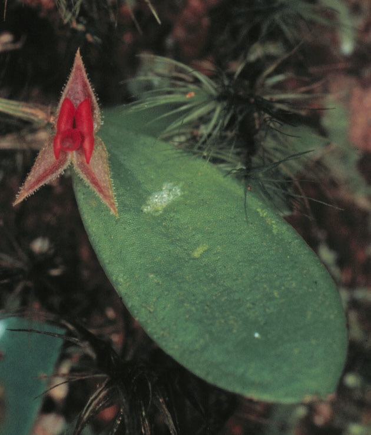

```{r setup, include=FALSE}
knitr::opts_chunk$set(echo = TRUE)
```

Fecha de la ultima revisión
```{r echo=FALSE}

Sys.Date()
```

```{r, eval=TRUE, echo=FALSE}
colorize <- function(x, color) {
  if (knitr::is_latex_output()) {
    sprintf("\\textcolor{%s}{%s}", color, x)
  } else if (knitr::is_html_output()) {
    sprintf("<span style='color: %s;'>%s</span>", color, 
      x)
  } else x
}

#`r colorize("some words in red", "red")`
```

```{r, bar_1, echo=FALSE, fig.show = "hold", out.width = "20%", fig.align = "default"}
knitr::include_graphics(c("Graficos/hex_ggversa.png", "Graficos/hex_Visualizacion_Datos.png"))
```

## Activar los paquetes

```{r, bar_2}
 
library(tidyverse) # paquete para manipulación de datos
library(ggversa) # paquete con datos 
library(janitor) # paquete para limpiar los nombres de las columnas
library(gridExtra) # paquete para organizar los gráficos
```

### Subir los datos

```{r}
DW=dipodium
DW=clean_names(DW)

DW
```


***

# Cuando usar geom_bar vs geom_histogram

En ggplot2, las funciones `geom_bar()` y `geom_histogram()` permiten representar datos mediante conteos, pero no son intercambiables porque cada una está diseñada para un tipo específico de variable y un modo particular de cálculo. `geom_bar()` se emplea cuando la variable en el eje x es categórica, ya que calcula automáticamente la frecuencia de observaciones por categoría. En contraste, `geom_histogram()` se utiliza para variables continuas, dividiendo el rango de valores en intervalos (bins) y contando cuántas observaciones caen dentro de cada uno para representar la distribución. Además, cuando los conteos o proporciones ya están pre‑calculados, la geometría apropiada es `geom_col()`, que simplemente representa los valores proporcionados. Por ello, la elección entre ambas funciones depende tanto de la naturaleza discreta o continua de la variable como de si los conteos deben ser generados por el gráfico o provienen de un resumen previo.

# Una variable discreta: Gráfico de barras con **geom_bar**

El gráfico de barras es una herramienta adecuada para representar la frecuencia de ocurrencia de eventos asociados a valores discretos o categóricos, como respuestas “sí/no”, clases taxonómicas, tratamientos experimentales, entre otros. La función geom_bar() genera este tipo de visualización al contar automáticamente cuántas veces aparece cada categoría en el conjunto de datos. La altura de cada barra refleja, por tanto, el número de observaciones correspondientes a la categoría situada en el eje X.

En el siguiente ejemplo, comenzaremos por eliminar los valores perdidos utilizando la función `drop_na()`, la cual excluye todas las filas que contienen valores NA. Posteriormente, emplearemos nuevamente el conjunto de datos de *Dipodium rosea* para ilustrar el uso de `geom_bar()`.

```{r bar_3,  echo=TRUE}


DW$number_of_flowers  # Antes de hacer los análisis mira los datos, y vea que hay muchas filas con **NA**, remueve **#** para activar la función. 

# Method 1

head(DW, n=7)

```


```{r bar_4}
DW %>%
  drop_na(number_of_flowers)%>%
  ggplot(aes(number_of_flowers))+
  geom_bar(fill="red",color="white")+
  xlab("Cantidad de Flores")+
  ylab("Frecuencia")+
  theme(axis.title=element_text(size=14,face="bold"))

```


```{r}

#names(DW)
DW %>% drop_na(pardalinum_or_roseum) %>% 
  ggplot(aes(pardalinum_or_roseum))+
  geom_bar(fill="red",color="white")+
  xlab("Especies de Dipodium")+
  ylab("Frecuencia")+
  theme(axis.title=element_text(size=14,face="bold"))
```


# Cambio de intensidad de color con **alpha**

Se puede cambiar la intensidad del color de las barras usando **alpha**.  los valores pueden variar de 0 a 1, donde 1 es mas intenso el color, aquí se utiliza un **alpha=0.3**. 

```{r bar_5,  echo=TRUE}

head(DW)


# [df(fila,columas)]

b=ggplot(DW[!is.na(DW$number_of_flowers),],
         aes(number_of_flowers))
b+geom_bar(alpha=.3,
               fill="blue",color="white")+
  xlab("Posiciones de las \n flores en la inflorescencia")+
  ylab("Frecuencia")+
  theme(axis.title=element_text(size=14,face="bold"))
```

***


```{r, bar_7, echo=FALSE, size='50%', out.extra='style="float:right; padding:10px"',  fig.cap='Figura: Lepanthes eltoroensis, EL Yunque, Puerto Rico'}

```


1. Seleccione el archivo "Lelto" en el paquete "ggversa".  Seleccione la variable adultos y juvenil, que representa la cantidad de plantas adulto y juvenil que se encuentra en el árbol. Los datos son de una pequeñita orquídea que esta limitado las veredas del "El Toro" y de los "Vientos Alizios" en el Yunque. 
     - Mire el nombre de las columnas primero
     - haz un gráfico de los adultos y otro de los juveniles
     - Cambie de color las barras en por lo menos una de las graficas
     - Cambie el nombre de los nombres de los ejes
     - Une las dos figuras en una sola
     - Sube el .html a MSTeam
     
     
```{r}
names(Lelto)

head(Lelto)
```
     

How to put two ggplot2 plots side by side using the cowplot package in R

```{r, bar_8, eval=FALSE, echo=FALSE}

a= ggplot(Lelto, aes(Adultos))+  # Mire el nombre de las columnas primero
    geom_bar()

b= ggplot(Lelto, aes(Juveniles))+  # Mire el nombre de las columnas primero
    geom_bar(fill="blue",color="white")

cowplot::plot_grid(a, b, labels = c("A", "B"))

ggsave("Graficos/Lelto_ejercicio.png")
```

***


# Multiples grupos 

Ahora incorporaremos una segunda variable discreta que distingue entre plantas **con frutos y plantas sin frutos**, con el fin de representar sus frecuencias a lo largo de las distintas posiciones de la flor en la inflorescencia. En el script se observa que la variable **Frutos_si_o_no** ha sido convertida en un factor. Esto es necesario porque, en el archivo original, la presencia o ausencia de frutos y flores fue codificada numéricamente mediante valores `1` y `0`. Si la columna hubiese utilizado categorías explícitas como “Sí” o “No”, no sería necesario convertirla en factor, ya que `ggplot2` las reconocería directamente como categorías. Sin embargo, al tratarse de valores numéricos, es indispensable especificar que corresponden a clases discretas mediante `factor()`.

El gráfico resultante presenta ambas categorías discretas superpuestas (posición por defecto: "stack"), de modo que la frecuencia del segundo grupo se suma a la del primero, tal como ocurre con `geom_histogram()` cuando se utiliza un segundo factor para apilar las frecuencias. De esta manera, la altura total de cada barra refleja el número acumulado de plantas para ambas categorías en cada posición de la inflorescencia.

```{r bar_9,  echo=TRUE}


DW%>%
  select(fruit_position_effect,frutos_si_o_no )%>% # Selecciona las variables
  drop_na(fruit_position_effect)%>% # Remueve los NA
ggplot(aes(fruit_position_effect))+ # Asigna la variable continua
geom_bar(aes(fill=factor(frutos_si_o_no)))+ # Asigna la variable discreta
  xlab("Posiciones de las flores \n en la inflorescencia")+
  ylab("Frecuencia")+
  theme(axis.title=element_text(size=14,face="bold"))+
 scale_fill_manual(values = c("green", "#36211D"))+
 scale_color_manual(values = c("yellow", "blue"))
```


```{r}
head(Lelto)
```

***

# Posicionar las barras uno al lado del otro

Cuando se trabaja con dos variables discretas, como la posición de la flor en la inflorescencia y la presencia o ausencia de frutos, el comportamiento por defecto de `geom_bar()` es apilar las categorías (posición = "stack"). Sin embargo, en muchas ocasiones es más informativo comparar los grupos directamente, colocándolos uno al lado del otro dentro de cada categoría principal del eje X.

Para lograr esta presentación comparativa se utiliza el argumento:

```{r dipodium_barra3,  echo=TRUE}

DW%>%
  select(fruit_position_effect,frutos_si_o_no )%>%
  drop_na(fruit_position_effect)%>%
  ggplot(aes(fruit_position_effect))+
  geom_bar(aes(fill=factor(frutos_si_o_no)),color="white",
           position = "dodge")+
  xlab("Posiciones de las flores en la inflorescencia")+
  ylab("Frecuencia")+
  guides(fill=FALSE)+
  theme(axis.title=element_text(size=14,face="bold"))


```

***


# Posicionar las barras una encima de la otra

En el siguiente gráfico exploraremos una alternativa diferente a la apilación automática que realiza `geom_bar()` cuando se trabaja con dos variables discretas. Al utilizar el argumento:

`ggplot2` ya no apila automáticamente las barras ni las coloca una al lado de la otra. En cambio, representa cada barra exactamente en su posición original, iniciando ambas en cero y dibujándolas una encima de la otra en el mismo espacio del eje X.
En otras palabras, "identity" instruye a `geom_bar()` a no realizar ninguna transformación espacial en la posición de las barras. El resultado es que cada categoría del factor secundario (por ejemplo, **con frutos y sin frutos**) ocupa exactamente el mismo ancho y la misma ubicación sobre el eje horizontal, lo que conduce a una superposición gráfica completa.
Este comportamiento puede ser útil en situaciones específicas, como cuando:

se desea comparar dos distribuciones exactamente en el mismo espacio,
se emplea transparencia (`alpha`) para visualizar la superposición,
se busca resaltar coincidencias o diferencias mediante colores semitransparentes,
o cuando la densidad visual es relevante para la interpretación.

A continuación se muestra un ejemplo usando los datos de Dipodium rosea. La superposición es total, ya que ambas barras comienzan desde cero en cada posición de la inflorescencia:


```{r dipodium_barra3b,  echo=TRUE}

DW%>%
  select(fruit_position_effect,frutos_si_o_no )%>%
  drop_na(fruit_position_effect)%>%
  ggplot(aes(fruit_position_effect))+
  geom_bar(aes(fill=factor(frutos_si_o_no)),color="white",
           position = "identity")+ # Para que cada grupo comience en cero
  xlab("Posiciones de las flores en la inflorescencia")+
  ylab("Frecuencia")+
  guides(fill=FALSE)+
  theme(axis.title=element_text(size=14,face="bold"))
```

***


# Porcentaje porporcional a todos los valores


Para representar las proporciones de cada grupo dentro del conjunto total de observaciones, es necesario transformar los conteos en porcentajes. En ggplot2, esto se realiza especificando en el argumento estético y la relación:

**y=(..count..)/sum(..count..)**. 

Esta expresión indica a ggplot2 que tome el conteo de cada barra (..count..) y lo divida entre la suma total de los conteos dentro del conjunto de datos representado. Como consecuencia, la altura de cada barra refleja la proporción de casos dentro de la categoría correspondiente, y la suma de todas las barras del gráfico equivale a 100%.

Este enfoque es muy útil cuando el interés no es comparar números absolutos, sino comprender qué fracción del total representa cada categoría o cada combinación de categorías.

fill=factor(Frutos_si_o_no)
```{r dipodium_barra3a,  echo=TRUE}


DW%>%
  select(fruit_position_effect,frutos_si_o_no )%>%
  drop_na(fruit_position_effect)%>%
  ggplot(aes(fruit_position_effect))+
  geom_bar(aes(y=(..count..)/sum(..count..), 
               fill=factor(frutos_si_o_no)),
               color="white", position="dodge")+ # Para que cada grupo comience en cero se usa position = "identity"
  xlab("Posiciones de las flores en la inflorescencia")+
  ylab("Frecuencia")+
  guides(fill=FALSE)+
  theme(axis.title=element_text(size=14,face="bold"))
```

***


***

# Porcentaje por valores de cada **X**


Cuando se desea que cada barra represente el 100% de los grupos dentro de cada categoría del eje X, se emplea el argumento:


**position="fill"**.


Esta opción transforma automáticamente los conteos en proporciones relativas dentro de cada categoría, de modo que todas las barras tienen la misma altura (equivalente al 100%), y las diferencias entre grupos se expresan como partes proporcionales dentro de cada barra.
En el siguiente ejemplo se incorpora una variable discreta—en este caso, la presencia de frutos (verde) o su ausencia (rojo). La visualización resultante permite identificar patrones ecológicos relevantes. Por ejemplo, se observa que en las posiciones superiores de la inflorescencia ( > 27 ), el porcentaje de flores que desarrollan frutos es notablemente menor en comparación con las posiciones basales. Esto sugiere una posible disminución en el éxito reproductivo a medida que aumenta la posición de la flor en la inflorescencia, un patrón consistente con gradientes de recursos, limitaciones energéticas o efectos posicionales comunes en plantas con inflorescencias alargadas.

```{r dipodium_barra4,  echo=TRUE}
require(scales)

DW%>%
  select(fruit_position_effect,frutos_si_o_no )%>%
  drop_na(fruit_position_effect)%>%
ggplot(aes(factor(fruit_position_effect),
             fill=factor(frutos_si_o_no)))+
geom_bar(aes(y=(..count..)/sum(..count..)),
           position="fill")+ # Para que cada columna sume a 1.0 se usa position = "fill"
  xlab("Posiciones de las flores en la inflorescencia")+
  ylab("Proporción")+
    guides(fill=FALSE)+
  theme(axis.title=element_text(size=10,face="bold"))

```

***


2. Seleccione el archivo "Lelto" en el paquete "ggversa".  Seleccione la variable adultos o juvenil, que representa la cantidad de plantas adulto o juvenil que se encuentra en el árbol. Los datos son de una pequeñita orquídea que esta limitado las veredas del "El Toro" y de los "Vientos Alizios" en el Yunque. Primero se va unir las columnas de juvenil con las de adultos, para después hacer un gráfico donde cada columna sume a 1.0 se usa position = "fill".
  
    -- paso 1
    
      head(Lelto)
      
    -- paso 2
    
      df=Lelto %>% 
      select(Juveniles, Adultos)
      
    --  paso 3
    
      dfLelto = df%>% 
      gather(key="Estado", value="Conteos") # `r colorize("gather( )", "red")` recuerda esta función, siempre me hace dificil encontrarla en el web.  


     -- Mire el nombre de las columnas primero y como esta organiado
     - Cambie de color las barras
     - Cambie el nombre de los nombres de los ejes
     - Salva el gráfico con extensión de .png
     - Sube el gráfico a .png a MSTeam
     
     


```{r, eval=FALSE, echo=FALSE}


head(Lelto)
df=Lelto %>% 
  select(Juveniles, Adultos)

df # mire como esta organizado los datos

dfLelto = df%>% 
  gather(key="Etapa_de_Vida", value="Conteos")

dfLelto # mire como esta organizado los datos


ggplot(dfLelto, aes(Conteos, fill=Etapa_de_Vida))+
  geom_bar(aes(y=(..count..)/sum(..count..)), position="fill")+
  xlab("Cantidad de plantas")+
  ylab("Proporción")
 
ggsave("Graficos/Lelto_ejercicio.png")
```


***


# Cambiar el orden de las barras

Para modificar el orden en que aparecen las barras en un gráfico, puede utilizarse la función `reorder()`, la cual permite ordenar los niveles de una variable categórica según los valores de otra variable asociada. En el siguiente ejemplo, las barras se ordenan de mayor a menor para facilitar la comparación visual. En el conjunto de datos de *Dipodium rosea*, esto resulta en que las posiciones de las flores en la inflorescencia se muestren ordenadas de la más alta a la más baja, proporcionando una representación más intuitiva del gradiente posicional.

```{r dipodium_barra5,  echo=TRUE}
library(forcats)

DW%>%
  select(fruit_position_effect,frutos_si_o_no )%>%
  drop_na(fruit_position_effect)%>%
ggplot(aes(reorder(factor(fruit_position_effect),-fruit_position_effect),
             fill=factor(frutos_si_o_no)))+
  geom_bar(aes(y=(..count..)/sum(..count..)))+
  xlab("Posiciones de las flores en la inflorescencia")+
  ylab("Proporción de flores con frutos")+
  guides(fill=FALSE)+
  theme(axis.title=element_text(size=14,face="bold"))+
  scale_fill_manual(values = c("red", "green"))


```


### 


```{r}
df=c(1:10)
df
-sort(df)

order(-df)
```


# Opciones y Parametros de **geom_bar**:


  * ggplot(el archivo de datos, aes(la variable continua))
  + geom_bar(stat=bin, x, y, alpha, color, fill, linetype, size)
    + alpha: la intensidad del color
    + fill: el color de la barra
    + color: el color de la línea alrededor de la barra
    + linetype: representa el estilo de línea
    + size: representa el grosor de la línea
    + weight; para modificar el valor original; entonces no sería, por ejemplo, el conteo/suma de los valores si no un valor ponderado (promedio ponderado).
