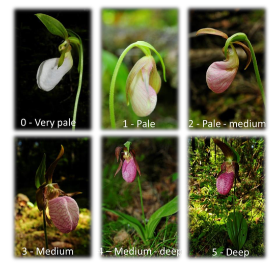

```{r setup, include=FALSE}
knitr::opts_chunk$set(echo = TRUE)
```

Fecha de la ultima revisión
```{r echo=FALSE}

Sys.Date()
```

```{r, eval=TRUE, echo=FALSE}
colorize <- function(x, color) {
  if (knitr::is_latex_output()) {
    sprintf("\\textcolor{%s}{%s}", color, x)
  } else if (knitr::is_html_output()) {
    sprintf("<span style='color: %s;'>%s</span>", color, 
      x)
  } else x
}

#`r colorize("some words in red", "red")`
```
# Introducción a RMarkdown

***
# Responsabilidad del estudiante

`r colorize("EL ESTUDIANTE es COMPLETAMENTE RESPONSABLE","red")` de ver estos videos y entender como usar la plataforma.

Mi sugerencias es que deberían ver los vídeos abajo múltiples veces y después compartir con otros estudiantes y hablar de los que entendió y aprendió.  

***
# Como Trabajar con un archivo RMarkdown

El siguiente modulo es para una introducción a la plataforma R y RMarkdown.

Vean los siguientes videos en Youtube para aprender los básico de RMarkdown. 

## Video #1

[Manejo del Markdown dentro de RStudio](https://www.youtube.com/watch?v=IPeOWx8KYkI)

***
## Video #2

[Aprende Markdown RÁPIDO!](https://www.youtube.com/watch?v=y6XdzBNC0_0)

***
Vaya al siguiente website y explora la pestaña de **Sintaxis Markdown**

[El website de Markdown](https://markdown.es) 


***

Aquí un otro video en ingles

[R Markdown with RStudio](https://www.youtube.com/watch?v=DNS7i2m4sB0)

***
<style>
mark{
    color:red;
}
</style>

<mark>Tamaño de la letra</mark>


`# Ejercicio #1`

# Ejercicio #1

`## Ejercicio #2`

## Ejercicio #2

`### Ejercicio #3`

### Ejercicio #3

`#### Ejercicio #4`

#### Ejercicio #4

`##### Ejercicio #5`

##### Ejercicio #5

`###### Ejercicio #6`

###### Ejercicio #6

***

### <mark>Letra en itálica</mark>

`*italica*`

*italica*

***

### <mark>Letra enegrecida</mark>

`**bold**`

**bold**

### <mark>Superscript</mark>

`supercript^2^`

supercript^2^

### <mark>Palabra eliminada</mark>

`~~Eliminada~~`

~~Eliminada~~

### <mark>Un enlance a un website</mark>

`[Google Website](https://www.google.com)`

[Google Website](https://www.google.com)

### <mark>Marca endash</mark>

`endash: --`

endash: --

### <mark>Marca emdash</mark>

`emdash: ---`

emdash: ---

### <mark>ellipsis</mark>

`ellipsis: ...`

ellipsis: ...

***

### <mark>Ecuaciones matematica en linea</mark>

`$y = mx + b$`

La ecuación básica de regresión lineal es la siguiente $y = mx + b$, es solamente un modelo lineal.

### <mark>Ecuaciones matematica en bloque</mark>

`$$E = mc^2$$`

$$E = mc^2$$

### <mark>texto en un bloque</mark>

`> Este texto aparecera en un bloque, como un comentario.`

> Este texto aparecera en un bloque, como un comentario.

***

### <mark>Lista no ordenada</mark>

````{verbatim}
* Item 1
* Item 2
* Item 3
  + sub-item 1
  + sub-item 2
````


* Item 1
* Item 2
* Item 3
  + sub-item 1
  + sub-item 2

***

### <mark>Lista ordenada</mark>

````{verbatim}
1. Item 1
2. Item 2
3. Item 3
 + sub-item 1
 + sub-item 2
````

 1. Item 1
 2. Item 2
 3. Item 3
  + sub-item 1
  + sub-item 2

***

### <mark>Tablas básicas</mark>

````{verbatim}
| Nombre | Edad | Sexo |
|--------|:------:|------:|
| Juan   | 23   | Masculina |
| Maria  | 25   | Femenino  |
````

| Nombre | Edad | Sexo |
|--------|:------:|------:|
| Juan   | 23   | Masculina |
| Maria  | 25   | Femenino  |

### <mark>Para añadir una linea horizontal</mark>

````{verbatim}
***
````

***

### <mark>Para añadir una imagen de una pagina web</mark>

``


***

### <mark>Para añadir una imagen de su computadora</mark>

``


***

### <mark>Opciones de los chunks</mark>

Nota que aquí estamos usando otro lenguaje de programación, se llama "knitr" y es un paquete de R. La información se pone en los {r, xxxx}. 

+ echo = FALSE, TRUE
+ eval = FALSE, TRUE
+ error = FALSE, TRUE
+ message = FALSE, TRUE
+ warning = FALSE, TRUE
+ include = FALSE, TRUE


```{r, echo=FALSE}
library(ggplot2)
```

***

### <mark>Figura como se ve sin modificar nada</mark>


```{r}
ggplot(mtcars, aes(x = wt, y = mpg)) + 
  geom_point()

```

***

### <mark>Figura como se ve más pequeña, con fig.width=3, fig.height=2</mark>

```{r, fig.width=3, fig.height=2}
ggplot(mtcars, aes(x = wt, y = mpg)) + 
  geom_point()

```

***

### <mark>Figura como se ve más pequeña, con out.width="50%"</mark>

```{r, out.width="50%"}
ggplot(mtcars, aes(x = wt, y = mpg)) + 
  geom_point()

```

***

### <mark>La misma grafica pero con fig.align='right' para alinear a la derecha</mark>


```{r, out.width="50%", fig.align='right', fig.cap="Gráfica de mpg vs wt"}
ggplot(mtcars, aes(x = wt, y = mpg)) + 
  geom_point()

```


***

### <mark>Como añadir el texto alrededor de la gráfica</mark>


```{r, echo=FALSE, out.width= "65%", out.extra='style="float:left; padding:10px"'}
ggplot(mtcars, aes(x = wt, y = mpg)) + 
  geom_point()

```


This is an R Markdown document. Markdown is a simple formatting syntax for authoring HTML, PDF, and MS Word documents. For more details on using R Markdown see <http://rmarkdown.rstudio.com>.

When you click the **Knit** button a document will be generated that includes both content as well as the output of any embedded R code chunks within the document. You can embed an R code chunk like this:

Note that the `echo = FALSE` parameter was added to the code chunk to prevent printing of the R code that generated the plot.